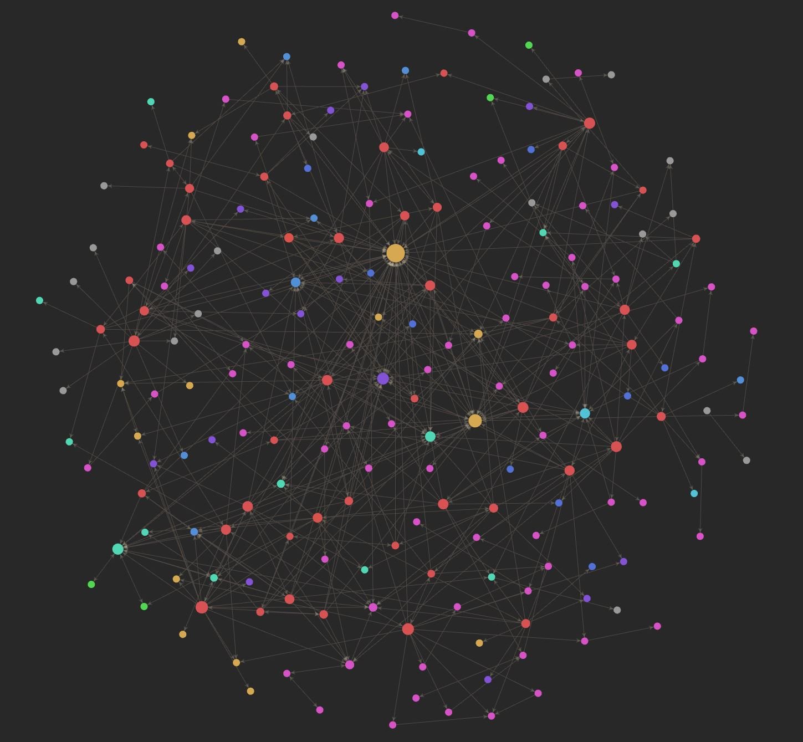
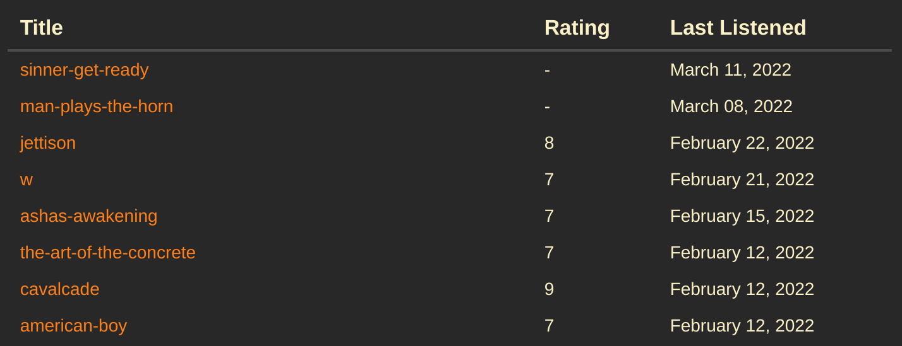
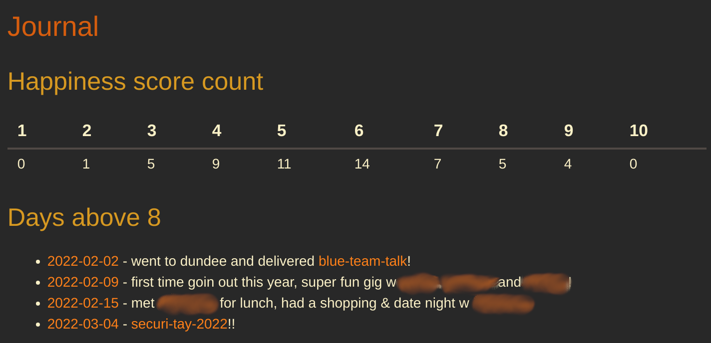

For the longest time, I've struggled to keep track of my ideas and thoughts.
I always attempt to have many ideas and projects on the go at once, and I keep individual and disparate notes sometimes, but it's never been cohesive or coherent.

Often i'll create a note somewhere to remember something, write the note, then leave it and never look at it again.
I never thought about creating a better system for maintaining knowledge, as it's not a problem I ever acknowledged.
I stumbled through uni with notes in arbitrary folder structures, guiding projects by slowly building the final product rather than doing any semblance of proper planning.

This year, unrelated to this problem, I decided to have a go at keeping track of my life via some kind of diary/journal.
I wanted to write down a reasonably granular overview of things I got up to each day, then in the evening do some journalling about how the day went and how I felt about it.

I have dysgraphia which rules out doing a physical journal, so I wanted to find a technological one that made the process as frictionless as possible.
I looking into several different tools, but decided to go with [obsidian](https://obsidian.md/).

There are many different note taking and writing softwares out there, but something that intrigued me with obsidian was the mention of a "second brain".
At the time I didn't really know what this meant, so I decided to do some reading on the topic.

This led me down a deep rabbit hole primarily focussed on the concept of a [Zettelkasten](https://en.wikipedia.org/wiki/Zettelkasten).
The idea is that notes, which represent ideas or information, should be created when new ideas or information is acquired.
Notes then have metadata, which allows them to be related directly to other notes.

Metadata for each note allows the system of knowledge to be navigated by how ideas connect, rather than arbitrary hierarchy.
The emphasis with a Zettelkasten is to create a hypertextual web of thought, not just a collection of writing.

These ideas when I initially read them struck me as kinda weird and almost too abstract to wrap my head around.
However, as I started my daily note-taking and journalling in Obsidian, it became a bit clearer as to what this means.

I've been using and developing this system for about two months now.
I no longer lose track of working on many projects at once, but am in fact able to context switch between various projects quite effectively.
New ideas I have are tracked and developed upon organically, and it barely feels like work.
Having all my ideas and projects so effectively tracked is also surprisingly motivating for doing work on them.

This system is the cohesive knowledge base that I never really knew I needed. It's had such a substantial effect on my ability to work, be productive, and manage my thoughts that it felt worth sharing.

This post covers how I approach the structure of my notes, some ways that I use the metadata of notes to do data analysis, then finally how I manage backing up and synchronising the notes across all my devices.
## Structure
The main premise behind this system is that it shouldn't become a bucket to dump passing thoughts into.

Most note-taking systems are transient.
They are convenient to add to, but after adding notes to the system over an extended period of time all there will be is a big pile of dissociated scribbles.

There is no mechanism by which to access knowledge, or further solidify understanding.
These notes primarily serve a purpose at the time of writing, used as fuel for an ongoing process, but mostly serve no value after that point.

To correct this, notes should be organised to evolve organically.

The structure of my system is not quite a Zettelkasten, but it's heavily inspired by it. 
There are a few basic attributes, which I will cover one by one:

### Notes should be associative, not hierarchical
No note is a child or parent of another note.
Creating a hierarchy of notes is an instinctive but inefficient method of organisation.

Something I used to do was have notes like University -> Year 3 -> Module X -> Lectures -> Lecture X.
This results in neatly organised but terribly inaccessible notes, and just made me never return to my deeply nested notes ever again.

If instead I created notes for concepts learned, and linked those to the lecture notes that discussed that concept, the notes and the value of those notes is immediately more accessible.

### Notes should be uniquely addressable
Since notes shouldn't be hierarchical, they need to be uniquely addressable so that they can be linked to regardless of their location.

This removes emphasis from organising notes in folders, and places emphasis on organising them by how they connect to one another.
Navigating the notes should be organic, and following links that relate to one another, even connecting new notes back to older notes, is a lot easier than what is the software equivelant of delving into a dusty filing cabinet to find what you're looking for.

### Notes should adhere to the principle of atomicity
Each note should address one thing and one thing only.

If I have a note for a particular project, and in that project I'm making use of a certain tool, the notes on that tool should exist independantly.
This is beneficial for a multitude of reasons, but mainly because it allows for more focus on relationship based organisation.

In the future if I use that tool again, I can immediately follow that link to the older project where I used it once before.
This relationship may have been missed or forgotten about if I hadn't created one note per concept.

This is a simple example of course, but this idea that relationships become a lot more discoverable when notes are atomic becomes crystal clear the more you use a system like this.

### Notes are written for my future self
I'm not writing these notes for an imagined audience, and I have the benefit of context for this system.
The notes don't need to be perfect, and they don't need to be fully comprehensive, but only as comprehensive as I think I will find useful.

Ultimately I'm treating this system as a tool, and for it to be useful it has to be practical and sustainable.
Obsessing over perfect notes and metadata will just take up too much time.

Of course, I do my best to write notes as comprehensively as possible, but I'm trying to make it a principle that I shouldn't be too hard on myself or too strict.

## Metadata
One thing I've enjoyed using this system for is cataloguing movies and albums that I've consumed this year.

Typically after watching a new film or listening to a new album, I'll create a note for it, jot down a few thoughts give it a rating out of 10, and make link from my daily journal noting that I consumed that media.
After a while, I realised it would be quite nice to do some kind of data aggregation on these.

Enter [obsidian-dataview](https://github.com/blacksmithgu/obsidian-dataview), a plugin that allows you to parse note metadata and do some rudimentary data analysis on it.

My workflow now is, after consuming some media, I'll create a note for it from the relevant template (in this case the album template):

	---
	tags: #[music, album]
	last-listened: <% tp.date.now("YYYY-MM-DD") %>
	rating: #6
	reviewed: no
	---
	# <% tp.file.title %>
	by artist

I'm using the Templater plugin for some nice features like pulling in the title from the filename, and adding the current date to the `last-listened` field.

Each field serves a specific purpose:

- `tags`: present in every file, and they are useful for querying only specific types of note
- `last-listened`: helps me sort albums by chronological listening order
- `rating`: how i rate the album out of 10
- `reviewed`: whether i've captured my thoughts on the album yet or not

I also typically have a note for each artist I listen to, so `by artist` is actually a link to an artist.

With all this in play, I can write a dataview to display all the albums I've listened to this year in chronological order:

    :::javascript
	dv.table(["Title", "Rating", "Last Listened"], dv.pages("#album")
	    .where(album => dv.date(album["last-listened"]) > dv.date("2022-01-01"))
	    .sort(album => album["last-listened"], "desc")
	    .map(album => [album.file.link, album.rating, dv.date(album["last-listened"])]))

Which looks like this (this isn't the full list):

A slightly more involved example is that every day I enter a happiness score into my daily journal in an inline data field.
I can use a dataview to aggregate these into a table:

    :::javascript
	let count_map = {}
	let count_array = [[]]
	
	for (let entry of dv.pages('"journal"')) {
	    let h = entry.happiness
	    count_map[h] = count_map[h] ? count_map[h] + 1 : 1;
	}
	
	let indices = Array.from({length: 10}, (_, i) => i + 1)
	
	for (let i of indices) {
		count_array[0].push(count_map[i] !== undefined ? [count_map[i]].toString() : 0)
	}
	
	dv.table(
	    indices.map(index => index.toString()), 
		count_array
		)

I also have a less complicated view to show a list of links and brief summaries of all days rated 9 or above:

	:::javascript
	dv.list(dv.pages('"journal"')
		.where(entry => entry.happiness > 8)
		.map(page => `${page.file.link} - ${page.summary}`))

All of this together looks like this:

Pretty cool!
Obviously this is just scratching the surface of this [self-tracking](https://en.wikipedia.org/wiki/Quantified_self) type data analysis, but I'm finding it pretty fun.

## Synchronising Files
Now we've gone over how I use this system, it's time to delve into the infrastructure behind it.

My goal was to synchronise my notes across all my devices, on Linux, Windows and Android.
Obsidian, which is a free tool, does have a service you can pay for to back up and synchronise your notes, but since they're just plaintext files I figured it wouldn't be too hard to implement myself.

I decided on git for storing the notes.
I'm very used to git-based workflows, plus obsidian has a nice community plugin that enables automated commiting, pushing, pulling etc of notes.

In the notes folder, I just created a new repo and added the notes to it:

	:::bash
	git init -b main
	git add .
	git commit -m 'initial commit'

Then I created and added a new SSH key to Github, created a new private notes repo, and added the key as allowed to push to and pull from that repo.
I had to do this as the key I usually use is password protected, which doesn't work for automatic backups.

Finally I installed the Obsidian Git plugin to Obsidian.
This was super easy to configure, and I just set it to commit and push any time I don't make changes for 2 minutes, and pull whenever I open Obsidian.
Committing, pushing and pulling can also all be done manually with keyboard shortcuts.

This works well for Windows and Linux, but on Android it's a bit more complicated.
If I do write up my solution for this I'll put it in its own blog post because this is already pretty lengthy, but essentially I used Tasker and Termux to set up an automatic job to pull + push the notes on my phone every 5 minutes.
Most of the time nothing happens, but when a change is made i get a little toast on the screen.

## Conclusions
Ultimately this has been a great project for many reasons.

I've found the process of journalling really cathartic and useful for managing my mental health.
It's great to be able to add a distinctive stopping point to the day, and being able to look back at particularly good days is also nice.

Organising my knowledge and learning across multiple disciplines (mainly music, programming and infosec) has been super useful.
I really like the atomic note sytem and expanding my notes on a topic has become easy, fluid and even fun.
I find myself wanting to learn more stuff so I have an excuse to make more notes!

Finally, Obsidian has proven to be a great tool in just how customisable and extensible it is.
There's a lot more to it that I didn't even touch on in this post that I've found super useful, and I would highly recommend it.

Thanks for reading!