This post documents an explorative journey I went through while attempting to bypass a firewall.
I've split it into a few sections:

1. Context
2. Initial Ideas and Testing
3. DNS Tunneling
4. Encrypted DNS
5. Combining Both Techniques
6. Conclusions


This won't really be a technical guide on how to set up any of the
things I discuss here, but I have linked to resources throughout the post that should tell
you how to set things up for yourself. If you really want more info about my particular 
setup you can dm me on [twitter](https://www.twitter.com/Sam1ser).

## Context

At my university we have a network of computers that are isolated from the rest of the university which we use for hacking.
Particularly for coursework that might involve hacking into vulnerable virtual machines or networks of virtual machines.

Often to do the coursework from the comfort of our own machines we would just copy the virtual machines
from the network onto a usb and set them up on our own hypervisor.
Recently however there was some coursework that involved a VM that is over 120GB in size.
A bit more awkward to simply transfer over and set up on our own computers.

I did however still want to do the coursework from my laptop rather than using the hacklab computers since
it's just more comfortable. I started looking into accessing the hacklab computers from outwith the
network. This desire to make it slightly more convenient to do my coursework combined with
my relentless stubbornness has led me down a massive rabbit hole, so I figured I would share my thought
process and findings here as I have learned a lot.

## Initial Ideas and Testing

So first thing I had to do was to really specify what I actually wanted to achieve. I figured a few things:

- Remote access to a machine on the hacklab network (obviously)
- Encrypted traffic (it's a hacklab, people be sniffin')
- Quick and easy to set up and tear down with minimal footprint

Interestingly since my laptop was also on a separate internal network (the uni wifi) I also knew
I would have to use an internet-facing proxy that both my laptop and the hacklab computer could connect to.
My immediate thoughts were to use a reverse SSH tunnel using a VPS as a proxy node for the tunnel.

This seemed to match all of my requirements and I have done a similar thing before on my homelab so it
wouldn't have been to hard too implement.

Things were theoretically looking up but after setting up a VPS to begin testing I immediately found
an issue... SSH is blocked by the hacklab firewall.
It's not possible to SSH from a hacklab computer to an internet facing box.

This makes a lot of sense but unfortunately it presented me with an issue. I would need to either try
and find a different remote access protocol or attempt to bypass the firewall.
I figured if SSH is blocked then other similar protocols are probably blocked too so I didn't
bother looking into the former.

After putting it off for a few days I remembered something that I had read in [this excellent blog post](https://medium.com/@ryankazanciyan/mr-robot-disassembled-eps3-8-stage3-torrent-8b80e14fc6fb)
that describes some hacking techniques used in Mr Robot. The author describes how Elliot uses DNS
tunneling to bypass an enemy's firewall as part of an elaborate hack to set up command and control
in their internal network. Really cool stuff and I figured I could try using the technique myself.

## DNS Tunneling
 
There are quite a few DNS tunneling applications available but the tool that was mentioned
in the Mr Robot blog post is Iodine, a seemingly fairly popular choice.
Instructions on the [Iodine github page](https://github.com/yarrick/iodine) go into detail in how to set it up, but here's a basic overview
of what DNS tunneling actually is and how it works:

1. Client encodes binary data within a DNS request
2. Request is sent to a public DNS resolver
3. The request is then forwarded to your DNS server
4. Your DNS server then decodes and processes the data
5. Server encodes and sends back the response over DNS
6. Client decodes the DNS response to binary data

The data is encoded by prepending it to the DNS request like so:

```
datatobeencoded.ns.yourdomain.xyz
```

This can actually be manually demonstrated using dig:

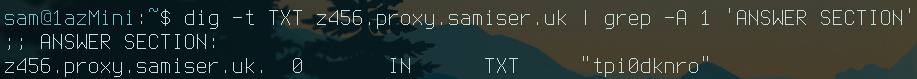

Here you can see there was some data prepended to the DNS request (z456)
and then the iodine server responded with some other data (tpi0dknro)

So now that I've configured DNS tunneling for my domain and I've confirmed that it works with dig,
all I have to do is use the iodine client to connect to the tunnel:

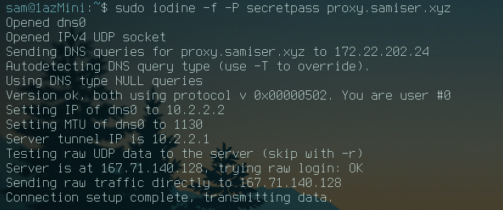

And now to confirm I have access to the server, I'll nmap the first two tunnel addresses:

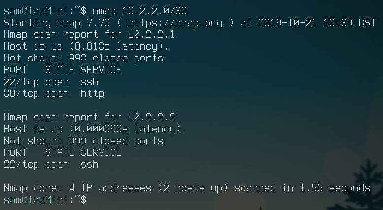

Nice, I've set up the tunnel and have access to the server from my laptop from an external network. 
All I have to do now is connect to the tunnel from the target and I should be able to
access it from my attacking machine/laptop through the tunnel.

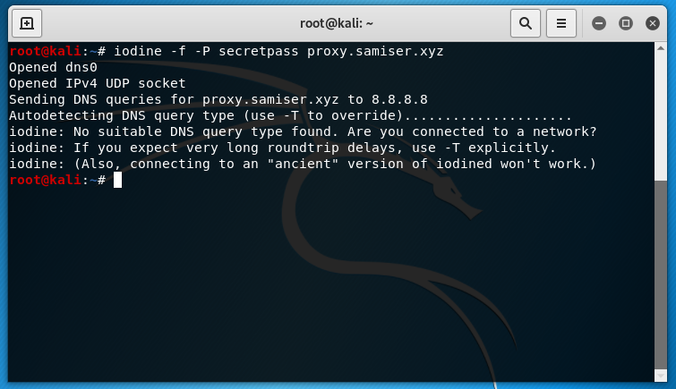

It failed to connect. This confused me for quite a long time, surely DNS traffic can't be blocked
so how could my tunnel be being blocked? Well after looking into it I found that some firewalls
are capable of detecting TCP over DNS traffic. You can find the post where I found out about this [here.](https://medium.com/@galolbardes/learn-how-easy-is-to-bypass-firewalls-using-dns-tunneling-and-also-how-to-block-it-3ed652f4a000) There's also a [Snort rule](https://www.snort.org/rule_docs/1-27046) that can detect Iodine handshakes.

I figured that at this point I was defeated. If the traffic could be detected and by the firewall then
there was no way I could use this technique succesfully, right? Unless there was some way that
the traffic could be encrypted...

## Encrypted DNS

Since I was stuck at this point I started asking about for any ideas. One person I spoke to is [Corey
Forbes](https://twitter.com/yeroc_sebrof), a pal of mine and Abertay grad currently working at F-secure.
He suggested I look into DNS over HTTPS, a proposed standard of encrypting DNS traffic.

Interestingly DNS traffic is among the last remaining fundamental internet traffic that is still
(mostly) unencrypted by default across the internet.
HTTPS is standard now to the point that most browsers even warn you if a website doesn't
use it, but DNS traffic remains completely available unencrypted to prying eyes.
I'm not going to get into the privacy issues or the heated debate surrounding this topic
but if you'd like to you can find a great post about all that [here.](https://www.wired.com/story/DNS-over-https-encrypted-web/)

While I was looking into the existing implementations of DNS encryption,
I found that there seems to be three currently being used:

1. **DNSCrypt** which seems to be more of a proof of concept than a usable standard
2. **DNS over HTTPS** which is a proposed standard but hasn't been finalised yet
3. **DNS over TLS** which is by far the most widely supported and accepted standard

DNS over TLS did seem to be the most reliable way to go, with many major internet infrastructure providers
running their public DNS resolvers with the option to opt in to it. Also, for Android devices as of Android 9.0
it is on by default for all DNS requests and cloudflare even has an app for both IOS and Android that
uses their DNS over TLS server 1.1.1.1

Ultimately though I was more concerned about whether any of these could be used in conjunction with a DNS tunnel
to bypass the detection mechanisms in place at the hacklab firewall.

First thing I had to do was set up DNS over TLS on my own system.
I ended up using stubby, a local DNS stub resolver that works using DNS over TLS.
It's in the debian repositories so it was just a matter of **sudo apt install stubby** and
after a bit of configuration was already set up running as a daemon.

For more info on how to set up and configure stubby I would recommend reading
its entry on the arch wiki [here.](https://wiki.archlinux.org/index.php/Stubby)

After ensuring it was running the first thing I tested was the simple dig DNS request that was
shown previously in the article. Running tcpdump in the background and grepping for only TXT
DNS queries, I first ran the command with normal DNS and then going through the local DNS stub:

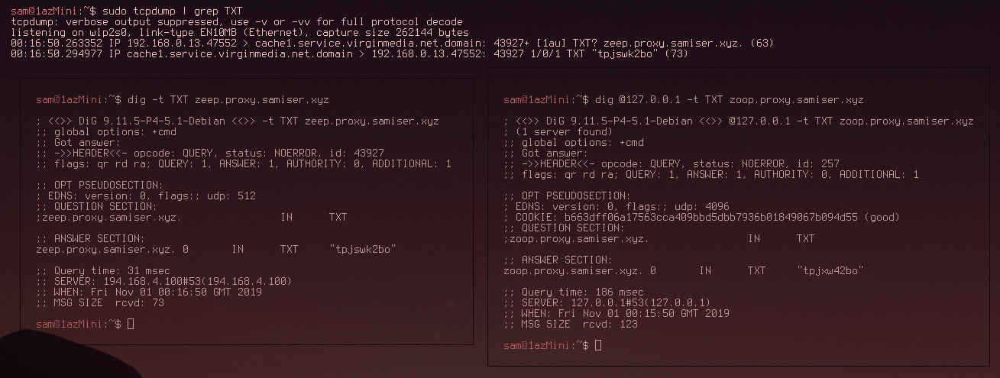

As can be seen in the above image, the first dig request was picked up but the second one wasn't.
This indicated that the DNS stub was succesfully masking the DNS TCP data by encrypting it. All
that was left to do now was connect to the DNS tunnel through the stub resolver.

Also, for testing purposes, I set up the DNScrypt-proxy client which actually uses
DNS over HTTPS to encrypt its traffic. I did the previous test with this and it
also succesfully encrypted the traffic. In the end I had stubby bound to 127.0.2.1:53
and DNScrypt-client bound to 127.0.3.1:53.

## Combining Both Techniques and Performance Measurements

After the previous section was done both stubby and DNScrypt-client were set up and configured on my system.
All I had to do now was send the iodine DNS requests to either of the loopback addresses. In iodine you can
actually just specify the DNS server to use as an option before the target domain like this:

```
iodine [options] [DNS server] [url]
```

An important thing to note is that by default Iodine doesn't actually work as a real DNS tunnel.
It works by sending the DNS requests directly to the server without going through a DNS resolver.
It also seems that when it's in this mode it sends a lot more data per DNS request.
Here's the speed test while using this mode:

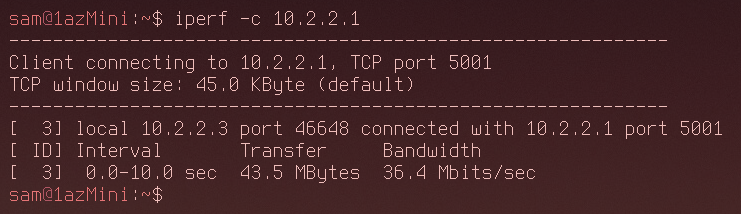

I got 36.4Mbits/s for bandwith which is relatively slow. It would be enough for an SSH connection
and to transfer files that aren't too big so that's good enough for me.

However, as I mentioned earlier, this isn't a technique that could be used to encrypt the DNS traffic
since it just sends it directly to the Iodine server. By adding -r to the command you can bypass
raw mode and attempt the proper query mode:

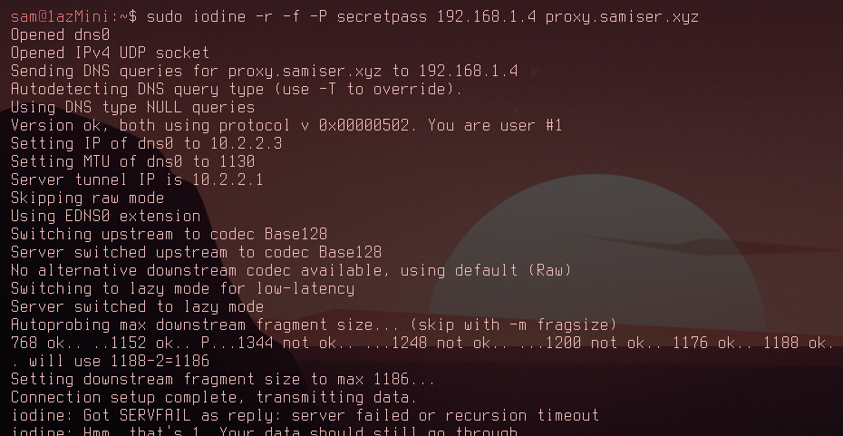

So now you can see Iodine trying to find the optimal size of data that could be appended to the DNS
requests. It settles on 1186. Also after connecting a lot of errors were coming up... This didn't fill
me with confidence. Here's the speed for connecting through my DNS resolver:

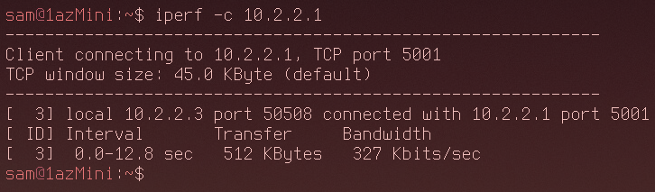

327Kbits/s is really not ideal. it's barely usable. However I could still manage
to get an SSH connection through the tunnel and it did stay open, so things still weren't looking too bad.

Now it was time to establish the tunnel connection while encrypting all of the DNS requests using DNS over TLS
with stubby:


Not looking good. Iodine has determined it can only use a data fragment size of 238, far smaller than last time.
There were also once again lots of errors while the connection was running. Time to test the speed:

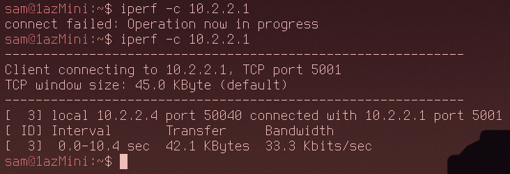

As you can see my initial attempt failed completely. The second attempt gave an impressively bad 33.3Kbits/s.
At this point I couldn't even consistently ping through the tunnel and an SSH connection was impossible to establish.

The slow speed is caused by a few different factors. Every piece of data sent has to be broken down into many fragments and sent to the server over multiple DNS requests, with larger amounts of data needing more requests.
 
Each request then needs to be encrypted by our local stub resolver which takes
a fair amount of time. Then it needs to be decoded at the other end and parsed by the server. Finally it gets sent back with another round of encrypting and decrypting.

Out of curiosity I also tried using DNScrypt-proxy to see if the results were any different:

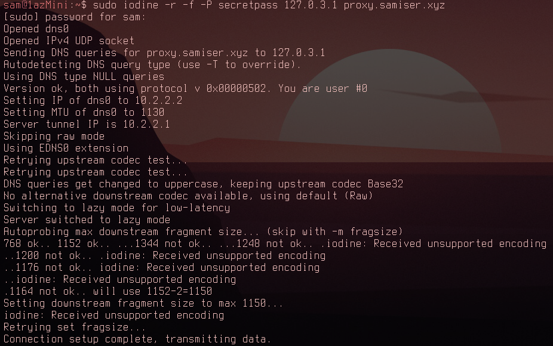

Interestingly as you can see Iodine could use a fragment size of 1150, significantly higher than when
using DNS over TLS with stubby. Now for the speed test:

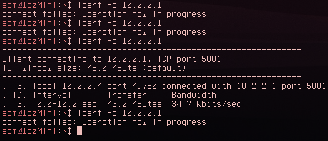

Well - once I could get it to connect - at 34.7Kbits/s it was in fact 1.4Kbits/s faster than DNS over TLS
and this result was consistent over multiple tests. Even though the speed difference was tiny, I could
actually establish an SSH connection this time and it was usable!

At this point my laptop was connected to the DNS tunnel but I still needed to connect the kali vm
on the target network (hacklab) to the tunnel as well.
First I needed to set up the encrypted DNS stub. Since dnscrypt-proxy allowed me to establish an
SSH connection that is what I used on the kali machine:

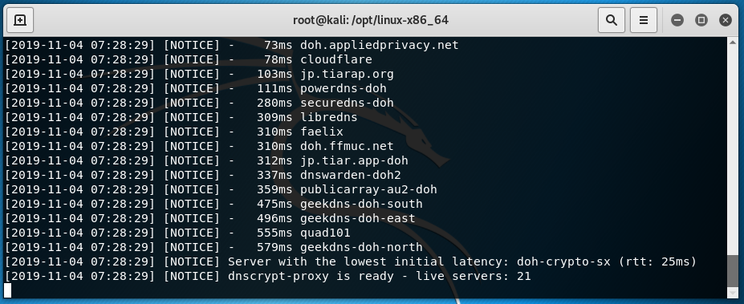

And then - after configuring resolv.conf to use the stub - tested that it works with dig:

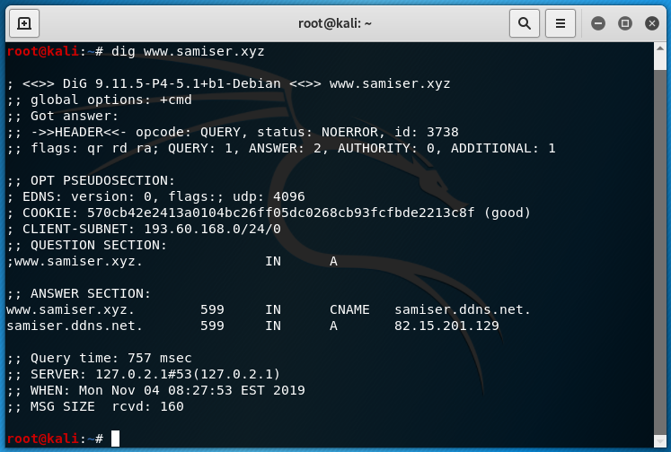

Iodine was already installed on kali by default so I just needed to connect to the tunnel:

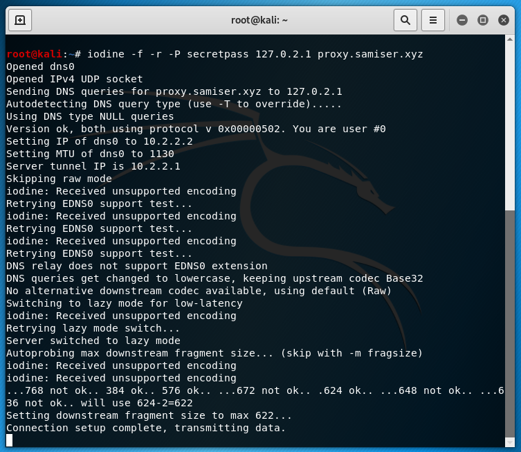

It works! The firewall has been bypassed. Iodine decided that 622 was the max fragment size
which works fine. Now from my laptop I ssh'd into the proxy server then from there I ssh'd
into the Kali machine. I then created and wrote to a file in the root directory:


And then from the kali machine itself I made sure the file was present:

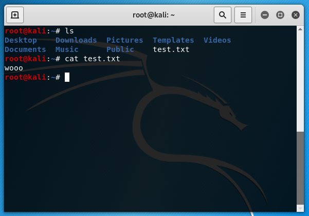

Everything is working! I really can't describe how chuffed I was at this point.
Finally I went backwards through the tunnel and ssh'd into my laptop from the kali
machine just to prove that it's possible:

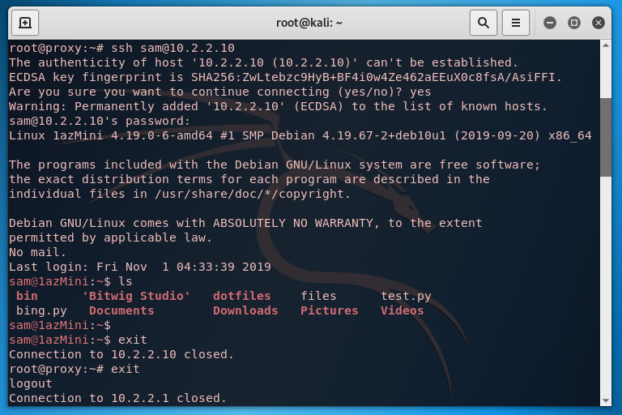

It works. Nice.

## Conclusions

Unfortunately in my case it wasn't really feasible to actually use this technique.
I needed a much faster connection as this was more a matter of convenience than anything else.
However, it did work! So if you're trying to get reverse SSH access to a network but SSH and
DNS tunnels are blocked, this technique will work for you.

If the firewall you're trying to bypass can't detect tcp over DNS traffic then you're in an even
better position because you don't have to use encrypted traffic and you can most likely
use the raw mode with a pretty decent bandwidth.

Something else to consider is that DNS tunneling is a very noisy technique. With a ridiculous amount
of DNS queries being sent even if it doesn't trigger an automatic filter someone looking back at the logs
will very easily be able to see what you've been doing.

I don't think it would be feasible to have encrypted DNS tunneling ever at a usable speed. Just having
to encrypt every single DNS request is way too resource intensive. Maybe with golang or something but
that's not really my area.

Ultimately I'm really happy that I managed to achieve what I set out to do. It's a nice feeling when
you dream up some crazy theoretical hack and then actually manage to pull it off.

Thanks for reading.
