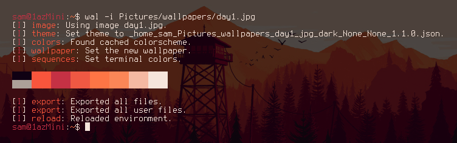
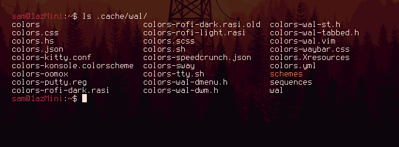
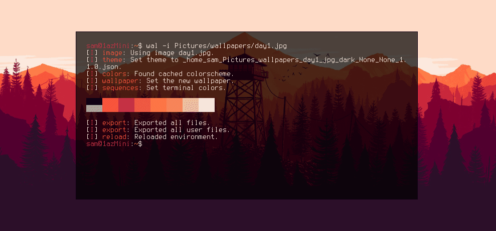
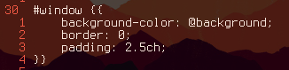
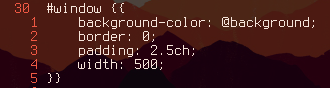
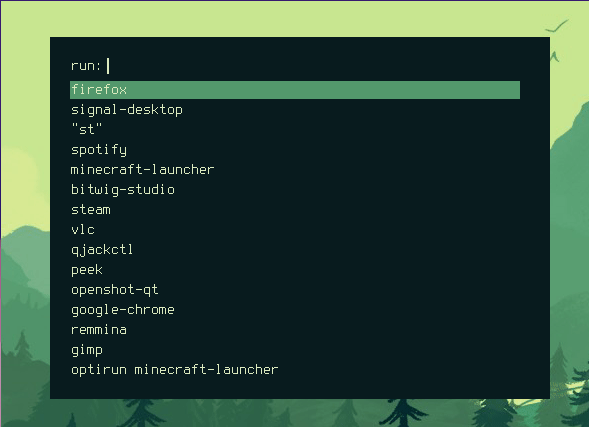
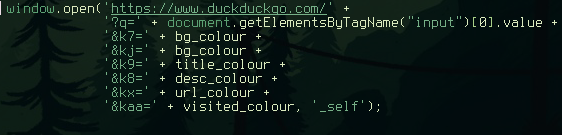
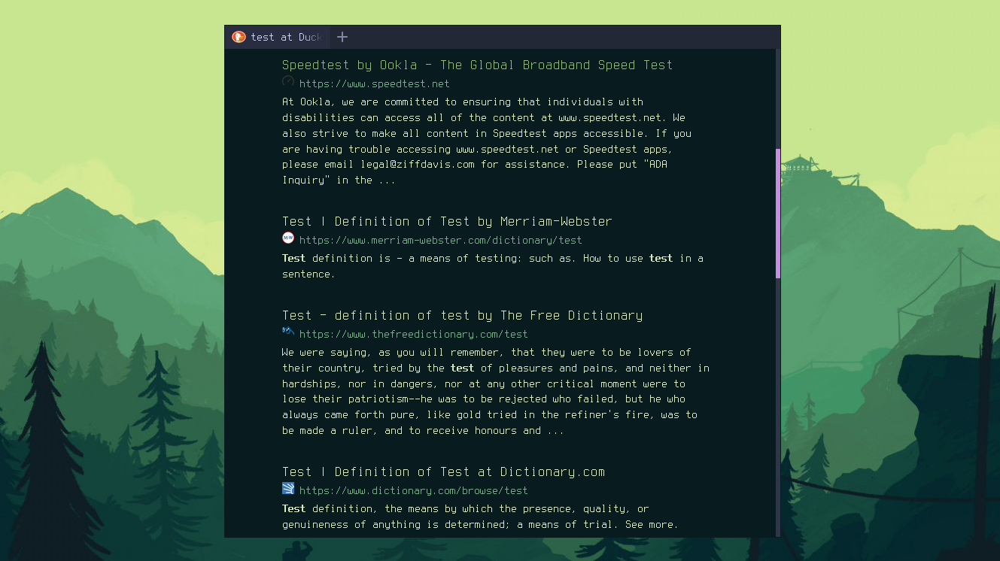
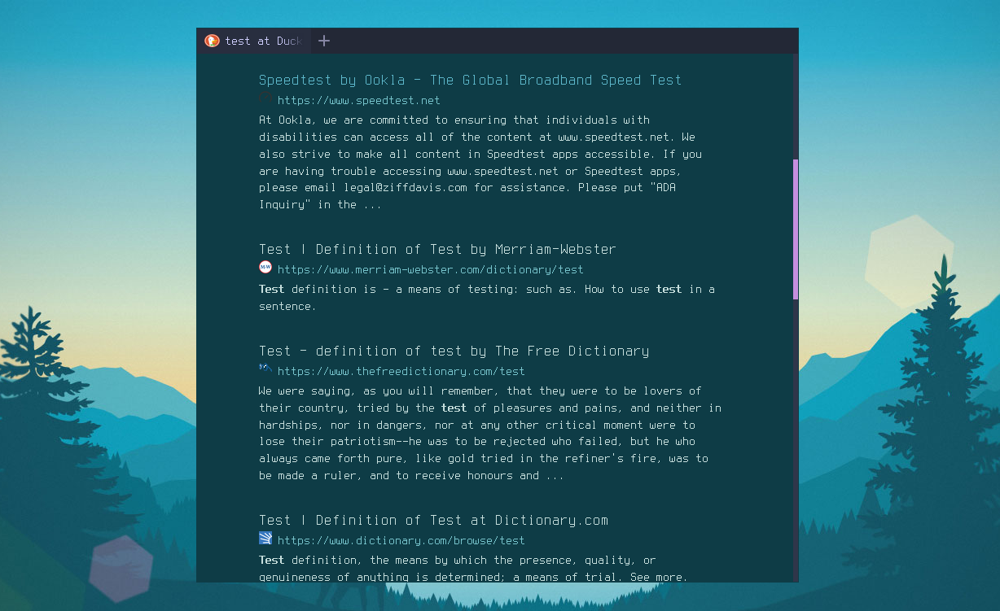

## What is Pywal?

Pywal essentially functions as a Desktop Background setter like feh, but while setting the background
it generates a colour palette from the dominant colours of the image used. It then immediately applies
these colours as your system's colour scheme using Xresources, changing the colours of any program that
uses the Xresources colours immediately. You can find more information [on the Github](https://github.com/dylanaraps/pywal)

It works very nicely and is a really effective and easy way to immediately apply a consistent aesthetic
across several applications. However, the really interesting stuff comes from the ways you can manually
expand and integrate the pywal colours into your system.

## Pywal Colour Scheme Files

As well as loading the colour scheme into Xresources pywal also generates themes for many different programs
that aren't necessarily activated by default or need some kind of manual configuration. These are found at
~/.cache/wal/

In the above screenshot you can see a lot of different application specific colour scheme files listed as
well as some more generic file type like json and yml. An application that I use a lot is rofi which, among
other things, functions as a program launcher.

As you can see in the screenshot above there are a few themes for rofi in the predefined templates.
I'm only really interested in the dark theme because it's more in line with how I've configured my i3 colours (using pywal).

This theme is nice and it goes well with the colours, but it's not quite how I would like it. I prefer a
thinner box and ideally transparency. Fortunately, pywal allows for the templating of these files.
In the pywal repo there is [a folder](https://github.com/dylanaraps/pywal/tree/master/pywal/templates) of all default theme templates.
If you copy one of these files to ~/.config/wal/templates/ pywal will then use that file as the template
instead of the default, allowing you to customise it.

## Custom Rofi Theme

So looking at the rofi config template we can see a section describing the window:

The rofi man page says that you can run **rofi -dump-config** to get all of the configuration options.
Then by grepping for width we can see that width is just defined by **width: 50;**. So in the template
we can change the width of the window by defining the width according to this format:

I found 500 works best for me. The rofi window now looks like this:

Better, but I still wanted transparency. Looking back at the default rofi config template it looks
like most of the background colours were either defined by the **@background** variable or the **@foreground**
variable. These variables are defined on lines 24 & 25 with {background} and {foreground} respectively.
This is fairly typical syntax for python string formatting, and looking in the [pywal docs](https://github.com/dylanaraps/pywal/wiki/User-Template-Files) confirms this.

Also described in the docs are modifiers that can be applied to the variables that will be replacing the
{variable} tags. By default just using {color2} for example outputs a hash with a hex code eg. **#FFFFFF**.
You can instead however use {color2.rgb} to, as you might guess, output the colour in rgb eg. **255,255,255**.

Since I wanted transparency I knew the colour would need an alpha value. There is an option to output the
variable in rgba format but then I couldn't manually override the alpha value. I ended up with this:

**background: rgba({background.rgb},0.7);**

so I'm using the rgb modifier to output the colour in rgb format but wrapping that in an rgba format
while defining my own alpvisited) and then encoded them into
the url along with the search term:

This gave some nice results:

You can find out more about DuckDuckGo url parameters [here](https://duckduckgo.com/params).

## Conclusion

Pywal is great. I feel like I've still only scratched the surface of using it in different ways for different
applications. I hope this inspires you to try playing about with it on your own system.

Thanks for reading.
