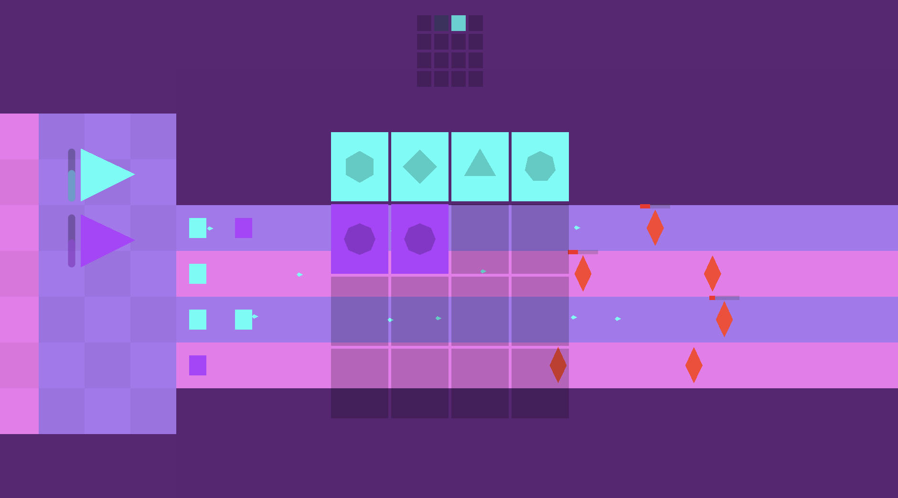
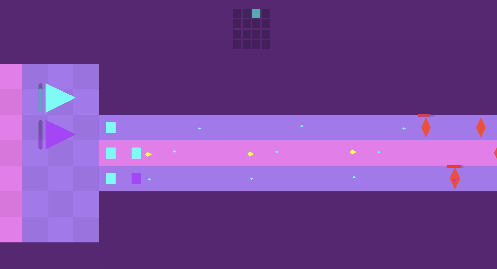
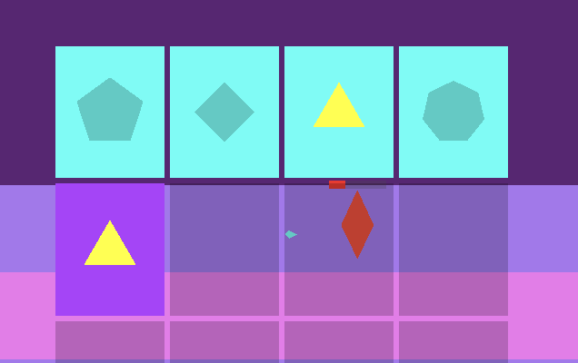

---
tags:
  - gamejam
  - dev
  - godot
title: "tuneful towers: my first game jam"
summary: an account of my first time participating in a game jam
date: 2025-05-22
publish: yes
---

## the lore

for a long time i've been interested in making games, and i've made a few
attempts to get into it, but i struggled with the scope and scale of
game-making. most of my attempts start with me having a cool game idea, i crack
open godot, start hacking away, and after a while i either get bogged down in
implementation details or keep focusing on things that aren't _core_ to making
the game work but are fun to try and solve.

i've made several projects like this, but most of them remain unfinished. my
lack of experience doing game dev and working in godot eventually leads me to a
point where i struggle to continue engaging with my own codebase, and i move on.

however, i've always suspected a game jam might help me remain focused on
getting something done. game jams have a short timeframe and an explicit goal
(get something finished and submitted) so it seemed like a good motivator.

so last month, for the first time, i signed up to
[godot wild jam 80](https://itch.io/jam/godot-wild-jam-80). i discovered this
jam while i was looking for jams to take part in, and i found it when it was
already two days into it's nine-day window for submission, but i figured the
remain seven days would be enough for me to have a good try at building
something.

the theme for the jam was _controlled chaos_, with an additional three optional
wildcards to use no text, give all characters silly names, and use only simple
shapes in the game. immediately simple shapes appealed to me since i'm not
particularly good at visual art, and no text was also interesting, with my
immediate thought to make a more vibes-based game.

for the theme itself i swithered between a few different ideas but i settled on
a music-based tower-defense type thing. i was thinking you could create towers
that would shoot enemies while generating random-ish music, and you could
rearrange them to create more harmonious music, powering up the tower damage
output.

## making the game

this section goes into some of the interesting technical challenges i faced
while making this game. if you don't care about that, you might wanna just skip
to the conclusions at the end.

the first thing i needed to figure out was the music system. i've heard that
rhythm games are notoriously hard to get right, and while this wasn't
specifically a rhythm game it still required some kind of globally synchronised
musical state that anything in the game could hook in to.

### managing musical state

i figured a
[singleton](https://docs.godotengine.org/en/latest/tutorials/scripting/singletons_autoload.html)
would be the best way to manage something like this, so i created a
[beatmanager](https://github.com/Samiser/tuneful-towers/blob/main/managers/beat_manager.gd)
that emits signals for various subdivisions of the main tempo, ranging from
eighth-note triplets to whole-notes:

```gdscript
const SUBDIVISIONS = {
    "full": 1,
    "half": 2,
    "quarter": 4,
    "quarter_triplet": 6,
    "eighth": 8,
    "eighth_quintuplets": 10,
    "eighth_triplet": 12,
}

# [... a bunch of other code ...]

func emit_subdivision_signals(step: int):
    for sub in SUBDIVISIONS.keys():
        var div = SUBDIVISIONS[sub]
        if step % (total_subdivs / div) == 0:
            global_subdivision_steps[sub] += 1
            emit_signal("beat", sub)
```

once i had this, i could create things that made use of the signals to do things
to the beat.

first was the towers themselves. i decided that there would be different types
of "tower" for different musical elements (melody, harmony, rhythm, bass) and
each tower could be used to deploy shooters that would fire bullets and play
notes.

each tower has a sequence of notes, and each shooter represents a note in the
sequence. when a new shooter is purchased/placed a random note is chosen and
assigned to it, and it gets added to the sequence:

```gdscript
func spawn_shooter_at(pos: Vector2) -> Node2D:
    var shooter = shooter_scene.instantiate()

    shooter.global_position = pos - position
    var random_note = possible_notes[randi_range(0, possible_notes.size() - 1)]

    shooter.note = random_note
    shooter.color = shooter_color
    shooter.damage = bullet_damage
    shooter.bullet_count = bullet_count
    shooter.index = shooters.size()
    shooter.audio_stream = audio_streams[random_note]
    shooter.shot.connect(_on_shot)
    shooter.destroyed.connect(_on_shooter_destroyed)

    money = 0.0
    if number_purchased < 7:
        number_purchased += 1
        cost *= 1.8

    if shooters.size() > 6:
        cost_bar.visible = false

    emit_signal("shooter_added", self, shooter)
    add_child(shooter)
    _stop_pulse()
    return shooter
```

then still in the tower, we hook into the beatmanager and iterate over the
sequence, triggering each shooter to fire whenever that shooter's index is the
current sequence index:

```gdscript
func _on_beat(subdivision):
    if subdivision == selected_subdivision:
        shooters = _get_shooter_notes()
        for shooter in shooters:
            if shooter.index == current_note_index:
                emit_signal("beat", self, current_note_index, shooter.note)
                shooter.shoot()

        current_note_index = (current_note_index + 1) % max(shooters.size(), 4)
```

the modulo at the end ensures that for the first four shooters the sequence
length is 4, but it can grow beyond that so you can have sequences of
interesting numbers like 5 or 7, with the max sequence length being 8.

so now there's towers that can spawn shooters which shoot in the order they are
placed, but i also needed them to play musical audio!

### handling audio

it took several attempts and iterations to figure out something that actually
worked for this. my first attempt was to have an audioplayer in the tower
itself, and have each shooter trigger the playing of its respective note in that
player. this made polyphony (playing multiple notes at the same time) awkward,
since playing a new note would cut off the old one.

eventually i realised the best way would be to have each shooter have it's own
audioplayer, and it would play its own note. i thought having too many
audioplayers might cause some performance issues, but it ended up working great,
even in the constrained environment of a browser. thanks godot devs!

to prevent having to load the audiostream every time a new shooter was placed, i
had the towers hold references to the audiostreams themselves, and just pass the
stream into each shooter when they were created:

```gdscript
func _melody_tower():
    possible_notes = [0, 1, 2, 3, 4]
    audio_streams = [
        load("res://towers/melody-pentatonic/melody_pentatonic_000.wav"),
        load("res://towers/melody-pentatonic/melody_pentatonic_001.wav"),
        load("res://towers/melody-pentatonic/melody_pentatonic_002.wav"),
        load("res://towers/melody-pentatonic/melody_pentatonic_003.wav"),
        load("res://towers/melody-pentatonic/melody_pentatonic_004.wav")
    ]

func spawn_shooter_at(pos: Vector2) -> Node2D:
    # only showing the relevant code here, the real function has more stuff
    var random_note = possible_notes[randi_range(0, possible_notes.size() - 1)]

    shooter.note = random_note

    shooter.audio_stream = audio_streams[random_note]

    return shooter
```

the function `_melody_tower()` initialises the relevant variables for that type
of tower, there are other functions for each different type of tower, meaning i
only needed one script for all the different tower types.

i was planning to also apply different audio effects to each tower eg reverb,
but i found that for some reason when running the game in a browser the audio
effects didn't work for some reason.

so now we have the fundemental logic of the game. buy towers, fill then extend
the musical sequences, create fun music! but if it was purely random with no
control it wouldn't be very fun, so i needed a way to actually edit the
sequence.

### sequence editor ui

to solve this, i created a ui to view the current sequence for each tower and
drag the notes around, changing the order they play in:


the sequence bars in the ui have their own representation of the steps in the
sequence, and communication between the shooters/towers and the ui was all
handled with
[signals](https://docs.godotengine.org/en/stable/getting_started/step_by_step/signals.html).
whenever a new shooter is placed, the gui hooks into that signal and updates the
visual representation with the new step in the sequence. likewise, if the
sequence is rearranged via the ui, the shooter indices are changed to represent
their new position in the sequence.

since all of this signal connecting was getting pretty complicated, i decided to
factor out the initialisation code for the towers and the ui into their own
managers so in `main.gd` im just calling the setup functions for each manager:

```gdscript
func _ready() -> void:
    var towers := get_tree().get_nodes_in_group("tower")

    tower_manager.setup(towers, map)
    wave_manager.setup(towers, map)
    ui_manager.setup(towers)
```

and in each manager i hook up the signals to wherever they need to go, for
example here's the tower_manager setup function:

```gdscript
func setup(towers_in: Array, map_in: Node) -> void:
    towers = towers_in
    map = map_in

    for tower in towers:
        tower.shooter_destroyed.connect(_on_shooter_destroyed)
        tower.clicked.connect(_on_tower_clicked)
        tower.beat.connect(_on_tower_beat)

    map.clicked.connect(_on_map_clicked)
```

another benefit of using this manager pattern was i could use the tower_manager
for inter-tower logic, which brings me to the next problem. i wanted to create a
synergy system where, for example, if you rearranged melody notes to play while
a chord with those notes was playing, they would do extra damage.

### musical synergy

this was one of the harder problems to tackle. each sequence could be various
lengths, so i needed a way to check whether two synergistic musical elements
were playing simultaneously not just in their respective sequence positions but
in _time_. for example, if one sequence had a length of 4 and the other a length
of 5, i couldn't just check whether the melody note in position 3 and the chord
in position 3 were the same, because by the second loop of the sequence they
would be playing at different times.

this gets even more complicated when you consider that different towers might be
playing on different subdivisions, eg chords play every half note but melody
notes play every eighth note.

to solve this, i kept track of a global step count for every subdivision and
used that to store the note of the most recent subdivision step for each tower:

```gdscript
func _on_tower_beat(tower: Node2D, step: int, note: int):
    var subdivision = tower.selected_subdivision
    var global_step = BeatManager.global_subdivision_steps[subdivision]

    match tower.tower_type:
        "harmony":
            harmony_step_notes[global_step] = { "note": note, "step": step }
            _check_synergy(global_step, tower)
        "bass":
            bass_step_notes[global_step] = { "note": note, "step": step }
            _check_synergy(global_step, tower)
        "melody":
            _check_melody_synergy(global_step, note, tower, step)
```

the simplest synergy was checking whether a chord and its bass note are being
played at the same time (eg a C major chord with a C in the bass):

```gdscript
func _check_synergy(global_step: int, tower: Node2D):
    # wait one frame to make sure both towers have updated their most recent step notes
    await get_tree().process_frame

    # reset all existing synergy
    for shooter in tower.shooters:
        shooter.has_synergy = false

    # get the latest step notes
    var h_data = harmony_step_notes[global_step]
    var b_data = bass_step_notes[global_step]

    # if the latest chord played is the same as the latest bass note, both get synergy
    # (this function is called for both towers)
    if tower.tower_type in ["harmony", "bass"] and h_data.note == b_data.note:
        _set_shooter_synergy(tower, b_data if tower.tower_type == "bass" else h_data)
```

more complex was checking whether the current melody note was the same as either
the latest chord or bass note. this is harder because several melody notes can
play over one chord/bass note, but since i've stored the most recently played
note for each, i can just compare against that:

```gdscript
func _check_melody_synergy(global_melody_step: int, melody_note: int, tower: Node2D, step: int):
    await get_tree().process_frame

    var matched := false

    for step_notes in [harmony_step_notes, bass_step_notes]:
        if step_notes.size() > 0:
            var latest_step = step_notes.keys().max()
            var note = step_notes[latest_step].note
            if note == melody_note:
                matched = true
                break

    for shooter in tower.shooters:
        shooter.has_synergy = false
        if matched and shooter.index == step:
            shooter.has_synergy = true
```

i wish i had more time to refine and implement more of these musical synergies
but that was all i could get done within the limited timeframe. i still think
it's pretty neat! here you can see some synergistic notes flying:


and i added highlighting to the sequence editor so you can see what notes are
synergistic with what other elements when hovering over them:


at this point the deadline was nearing and that was about all i had time to
implement, so i submitted the game to the jam!

## feedback and conclusions

as you can see on the
[submission page](https://itch.io/jam/godot-wild-jam-80/rate/3492049) i ended up
placing 26th overall out of 202 entries, and 7th in originality, which i was
really happy with! i also got lots of really great comments and feedback.

i think the main sentiments were that it was a cool and unique idea with an
interesting mechanic but it could probably be clearer how it all works, which i
agree with. there's a very basic tutorial but i think i was kind of hurt by the
no text wildcard, it would probably be better if there was some text explaining
how the systems worked.

it was so much fun during the voting period playing other people's games, rating
them and exchanging feedback. so many talented folks take part in these jams and
it felt incredible to be included in that!

the jam ended up being a fantastic way to force myself to come up with an idea
and scope it down to the point that i would be able to complete it within 7
days. also, since i'm an enthusiast of the godot engine, it was really inspiring
seeing all the different ways that folks are able to make use of it.

i'm really proud of what i managed to create and i'm looking forward to taking
part in more jams!

you can play my game, tuneful towers,
[here](https://samiser.itch.io/tuneful-towers)

you can also view the full source code
[here](https://github.com/Samiser/tuneful-towers)
