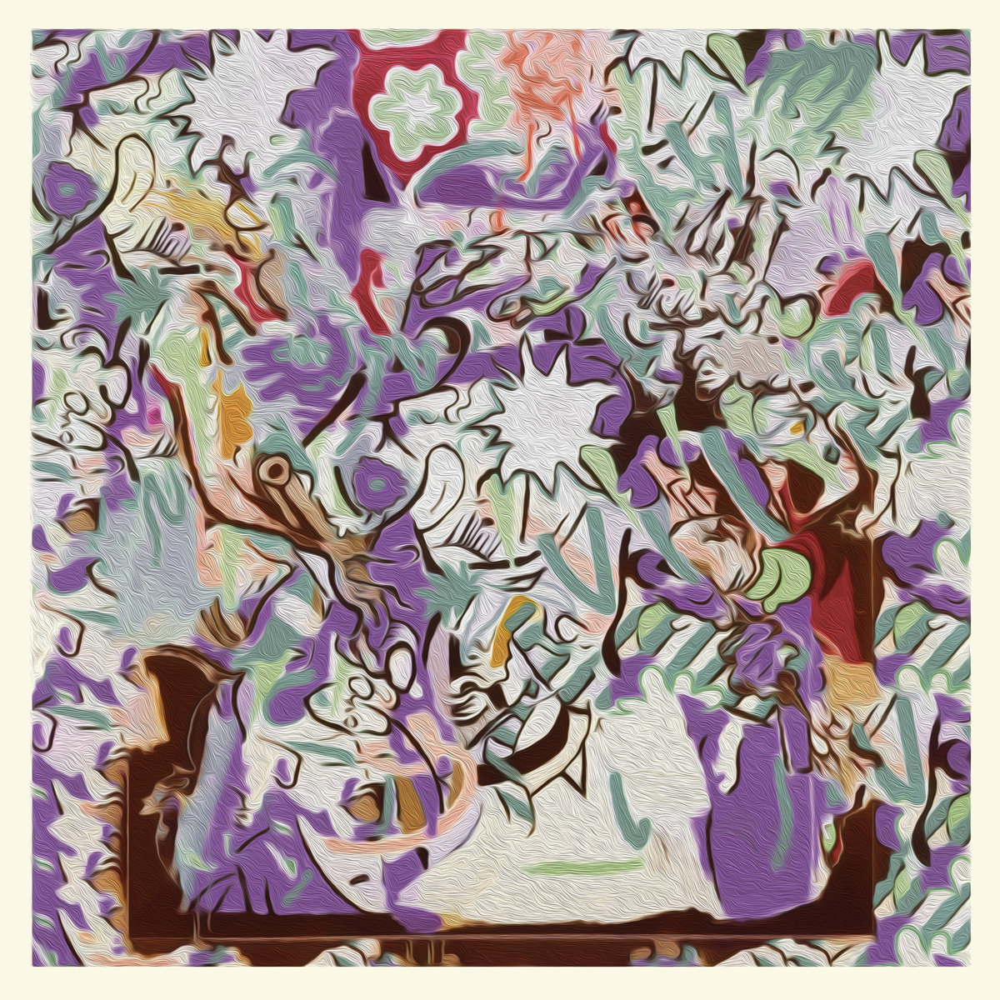
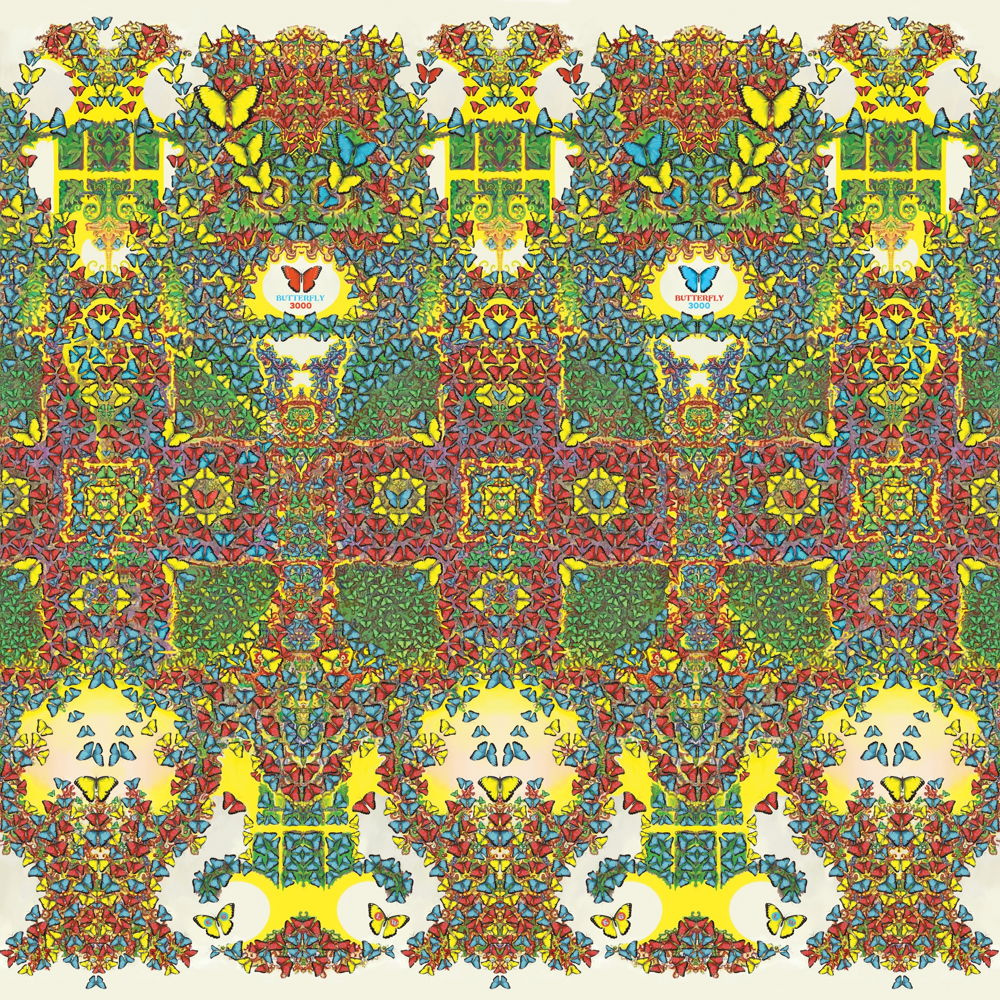
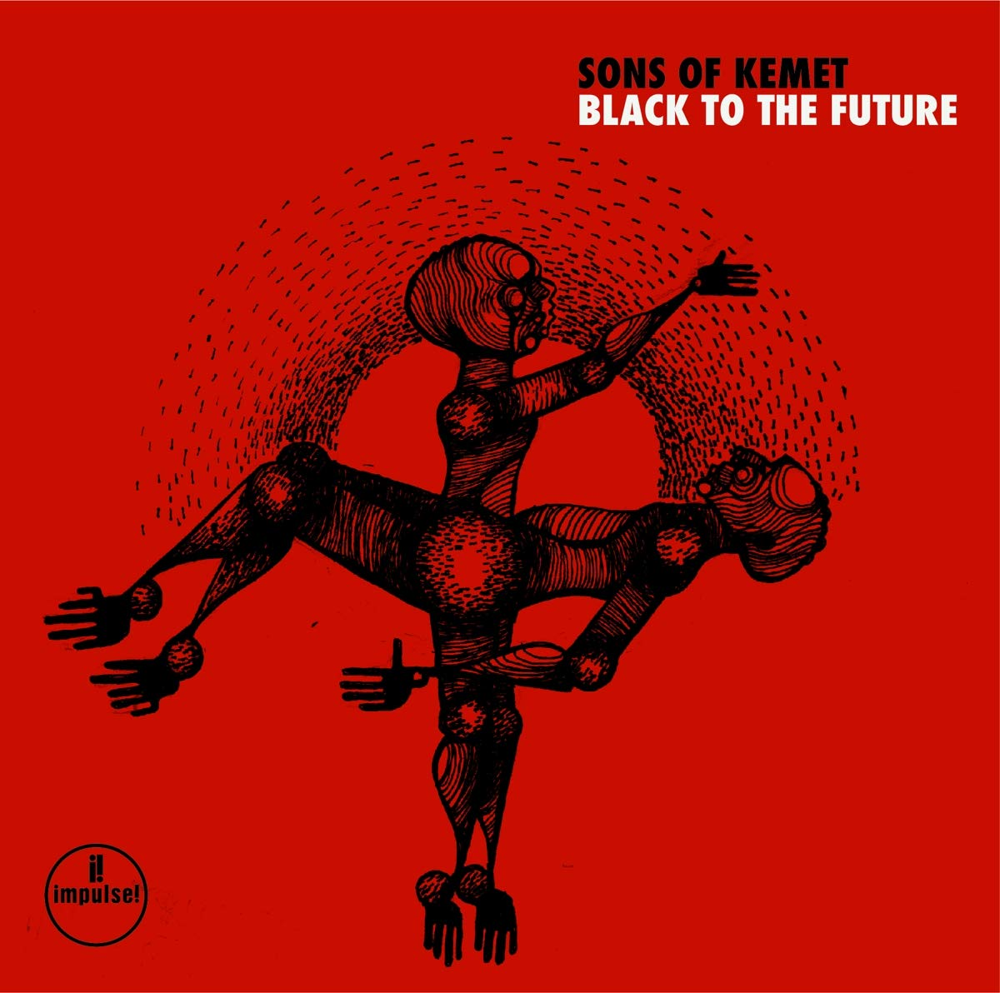
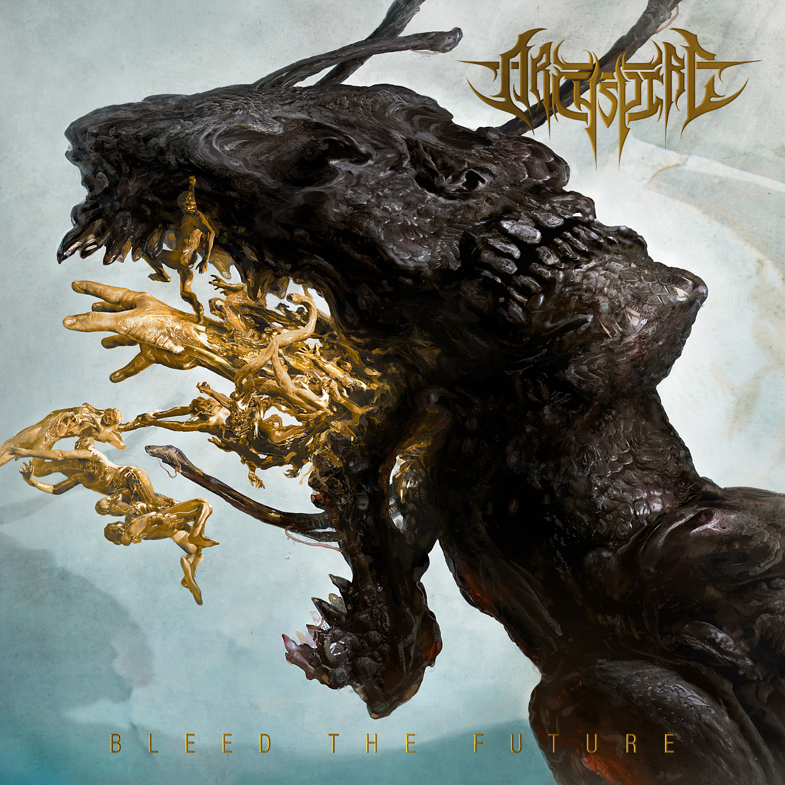
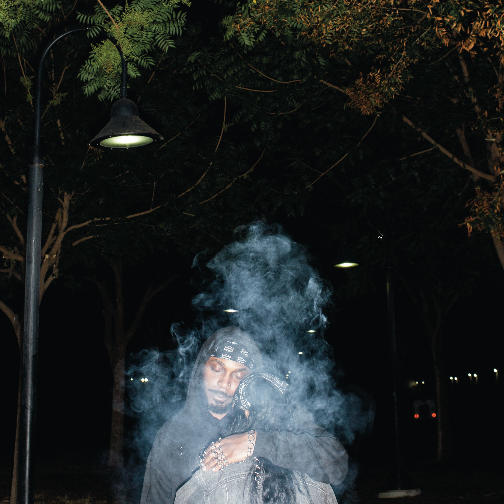
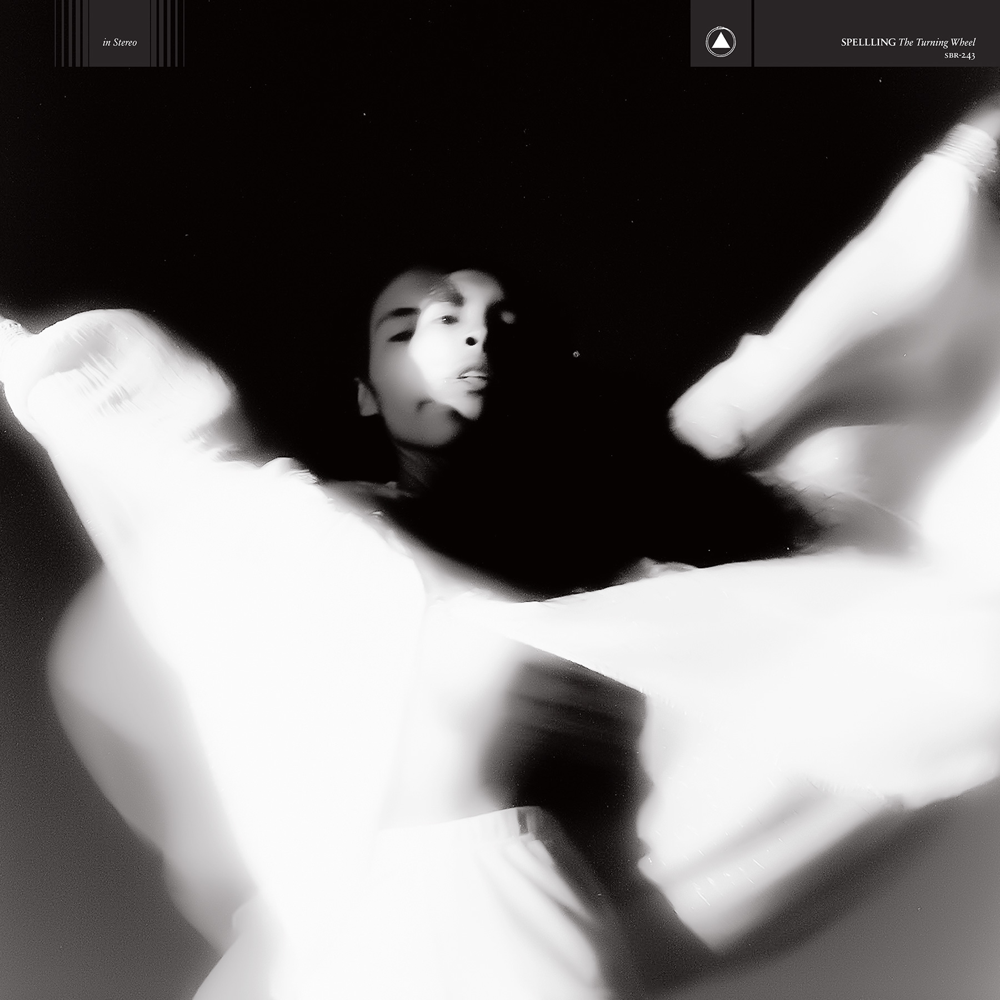
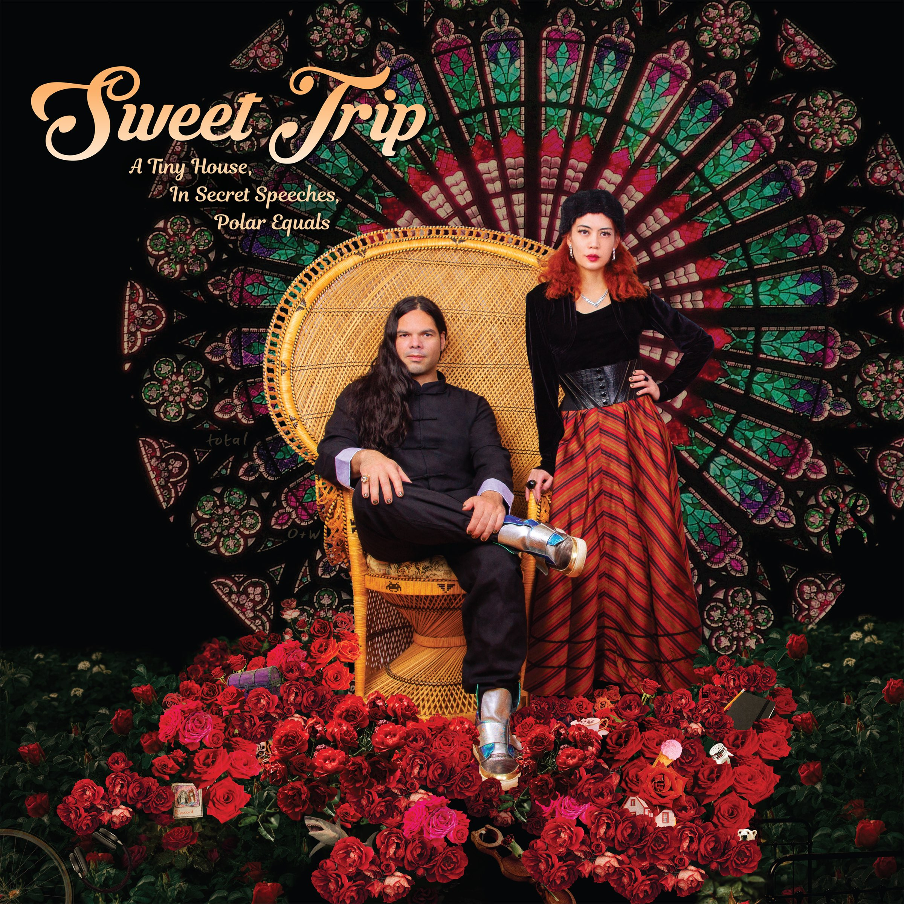
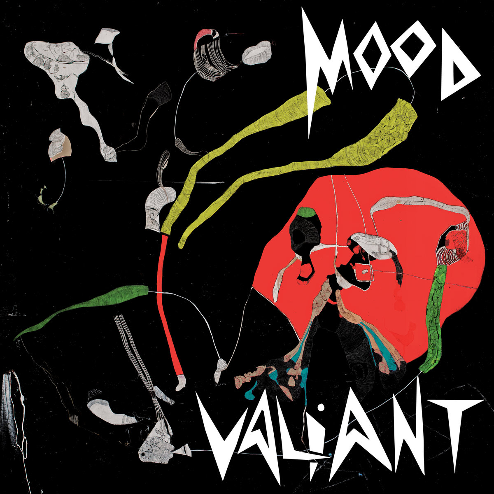
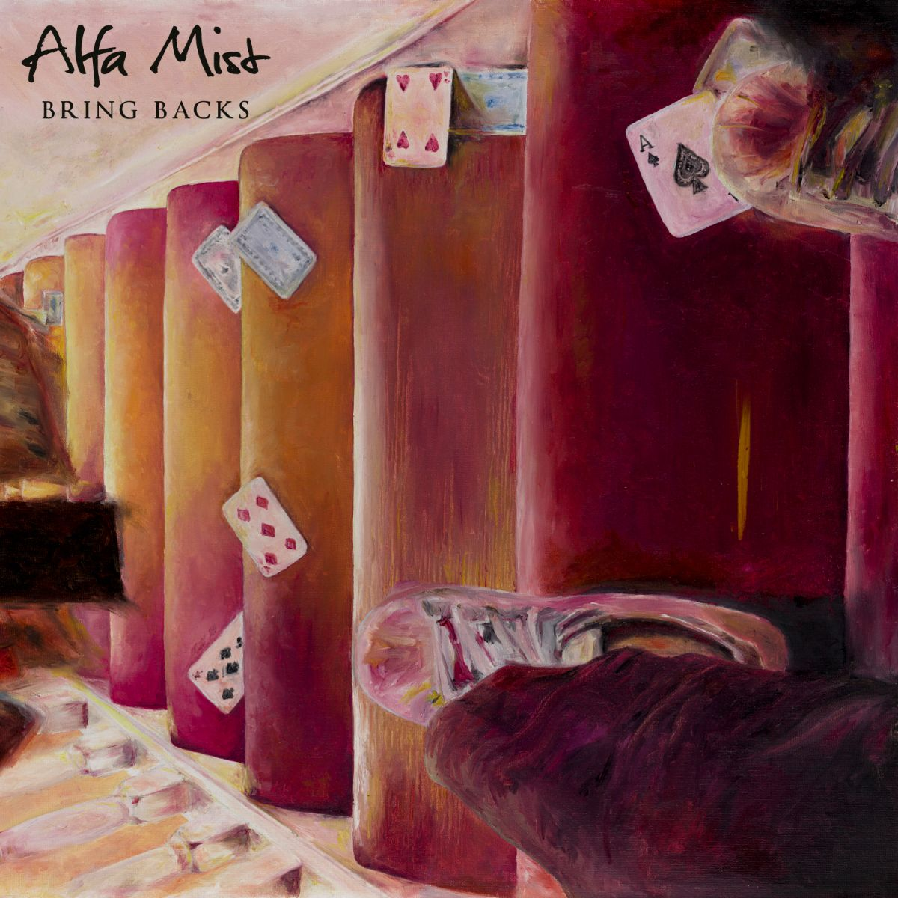

2021 was a weird year, but a lack of stuff happening gave me some extra time to delve into the great music released throughout. Here's my fav albums of the year, along with some brief thoughts for each album. They're in no particular order.

## Going Going Gone - Mild High Club

I found Mild High Club back in 2017 when they collab'd with King Gizzard and the Lizard Wizard.
I've listened to their other two albums, Skiptracing and Timeline, endlessly.
I was very excited to see them release a new album this year, and it didn't disappoint.

The album is really a blend of many different genres, moving fluently from bossa nova to disco to funk with real attention to detail and incredible intricacy.
The production is very unique, and even though it's not particularly challenging there is plenty of interesting experimentation to listen out for.

**Fav Tracks**: *A New High*, *It's Over Again*

## Butterfly 3000 - King Gizzard & The Lizard Wizard

King Gizzard & The Lizard Wizard are probably my favourite band of all time. They continue to amaze me with their sheer versitility, from dreamy folk to thrash metal, and this album is no exception.

Something Gizz haven't really explored much in the past is synthesizer sounds. This album however is an ode to the synth, which particularly appeals to me as a synth nerd.
Like every other genre they attempt to conquer, they adapt their unique gizzness to synth-based dream-pop flawlessly.
Layers of vintage synth sounds are woven into their distinct drum & guitar style in an incredibly satisying way, with the dreamy vocals especially lending themselves to the genre.

Shanghai is probably one of my fav songs they're ever made.

**Fav Tracks**: *Shanghai*, *Catching Smoke*

## Black To The Future - Sons Of Kemet

Afrobeat & carribean influenced record by London jazz group Sons of Kemet. This record, much like their previous My Queen Is a Reptile, combines intense rhythms and instrumentation with lyrics discussing being black in the UK. Their formula is to create these upbeat instrumentals while featuring various different guest vocalists.

This album has a really great sense of composition and cohesion. Each instrument provides incredible layers of depth, but it all just works together perfectly. The drums especially for me are a highlight, with tight groves being mixed with lovely syncopation and polyrhythms.

The spoken word and rapping is also incredible, with the energy of the vocals and lyrics being reflected directly in the energy of the instruments. This album was recorded in the months following the murder of George Floyd and subsequent BLM movement, and this outrage is the subject of the album. Reading the track titles sequentially reveals this album's statement of racial injustice in a poignant and succinct way.

**Fav Tracks**: *Pick Up Your Burning Cross*, *Hustle*

## Bleed the Future - Archspire

Some of the greatest mastery of each band member's respective instruments i've ever witnessed. Ultra-technical, hyper-speed extremely brutal death/tech metal. Super fun to listen to, surprisingly catchy, and just mind-blowingly impressive.

The neoclassical elements are really nice, moving directly from Mozart quotes (the opening of Reverie on the Onyx) to face melting harmonic minor riffs.
Tech metal like Necrophagist can sometimes stray into the realm of being technical for the sake of it, but I really think this album achieves the perfect balance between musicianship and musicality.

**Fav Tracks**: *Drone Corpse Aviator*, *Reverie on the Onyx*

## By The Time I Get to Phoenix - Injury Reserve

This is an extremely unique exploration of the experimental hip-hop genre, venturing into industrial and avante-garde territory.
With Stepa J. Groggs' tragic passing in 2020, this album is a primarily a deep dive into the miserable and disturbing world of grief, loss and death.

Evoking similar feeling as A Crow Looked at Me, this album really delves into the members feelings of grief and loss following the death of their band member.

The first half is chaotic and intense, with intrumentals gesturing towards a groove before tearing you away from it, dancing between different ideas in a discontented but somehow cohesive motion.
The latter half of the album, imo, is what makes it really special. Knees for example explores how despite living through painful life events, sometimes you don't take anything from it or grow from it, it just hurts.

**Fav Tracks**: *Outside*, *Knees*

## LP! - JPEGMAFIA

JPEGMAFIA is one of my favourite artists of all time, with his entire discography being wholly impressive while continuing to develop unique flavour.
Developing further on the glitch inspired works of Veteran and All My Heros Are Cornballs, this record takes these intrumental ideas to a new level.
The production and sample flipping throughout is incredibly unique and inventive, from sampling Animals as Leaders to Britney Spears while still keeping the album aesthetically consistent.

Lyrically, Peggy is impressively in touch with internet culture, which is refreshing to hear in such a successful artist.
He consistently delivers clever wordplay and tongue-in-cheek references in a very satisfying way.

All in all a super fun album to listen to, and a continuation of Peggy's brilliance.

**Fav Tracks**: *TRUST!*, *END CREDITS!*, *WHAT KIND OF RAPPIN' IS THIS?*

## The Turning Wheel - Spelling

Initially when I listened to this album I didn't really enjoy it that much, but it was so unique and generally highly praised that I decided to stick with it, and I'm really glad that I did.

This is foremost an Art Pop album, but it delves into so many different genres.
It's a grand and immersive experience and really unlike anything else I've heard.
The arrangements and instrumentation on this album is perfect, blending layers of synthy goodness with enchanting strings and haunting vocals.

The lyrics are equally immersive, delving into many very personal experiences in simple but effective ways.
Boys at School for example is a proggy epic about the troubles she faced as a teenager.

Ultimately this album is just a well crafted expression of Spellling's world, and the perfect immersion in that world is what makes this album so special.

**Fav Tracks**: *Little Deer*, *The Future*, *Boys at School*, 

## A Tiny House, In Secret Speeches, Polar Equals - Sweet Trip

Sweet Trip's first release since 2009, this album is really a return to what makes them special while also bringing together 12 years of further experience that the duo has had since then.
This is a dream pop, shoegaze & IDM masterpiece, dipping into elements of ambient and indie rock/pop, it's more of their classic style that I really love.

The duo sounds as good as they ever have, which is impressive for having such a long hiatus.
Their previous two albums have become albums that I come back to extremely often and am now intimately familiar with, and I have no doubt this album will be the same.

**Fav Tracks**: *Surviving a Smile*, *Chapters*, *Polar Equals*

## Mood Valiant - Hiatus Kaiyote

This album was my introduction to Hiatus Kaiyote, and after listening I went back and listened to their entire discography. The sheer groove of this band is astounding.

Predominantly this is a neo-soul record, but I think it's not really accurate to describe it as that. Red Room is the most neo-souley track and it's fantastic, but then tracks like Chivalry Is Not Dead really go outside the genre into more intense and synchopated grooves.

It's an exploration of many different sounds, but they all land tightly in the pocket.
Super catchy and really fun to listen to.

**Fav Tracks**: *Slip Into Something Soft*, *Chivalry Is Not Dead*, *Red Room*

## Bring Backs - Alfa Mist

Another person I've previously listened to endlessly, Antiphon from 2017 is how I discovered Alfa Mist.
This album filled my high expectations, with each song having it's own distinct and unique character while all being coherent hip-hop inspired jazz.

I wouldn't say this album particularly breaks any new ground, but it does achieve what it sets out to do so so well.
This is a solid jazz album with luscious production, fantastic harmony, and engaging improvisational passages.
Something I love about Alfa Mist is his ability to weave in complex rhythms and time signatures into the music without breaking the flow, and this is present all over.

This is a great album to stick on in the background, but will also reward you for listening carefully to the composition.

**Fav Tracks**: *Teki*, *People*, *Attune*
